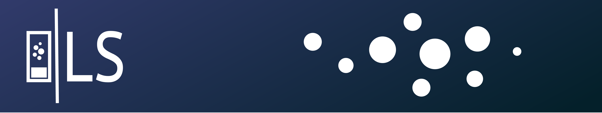
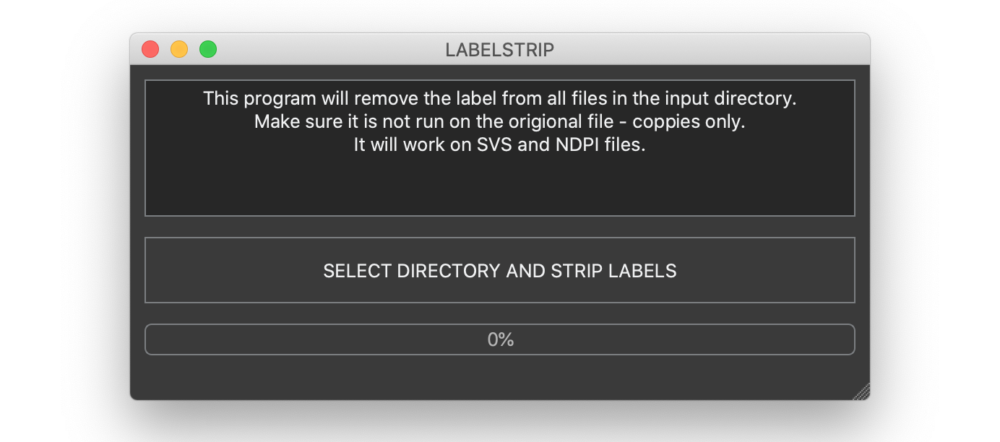

# labelstrip 

This was written to distribute an application to remove labels from whole slide image SVS files. As the original required scripting knowledge to run.

 

*Figure 1. Image of the GUI for labelstrip.*

### Usage

Download the MAC version of the app - [here](https://github.com/c-arthurs/labelstrip/releases/download/v0.2/labelstrip_macos.app.zip)

  
Notes on mac app

  <a>
  The user may have to right click and select open to get it to open for the first time</a> 

Download the PC version of the app - [here](https://github.com/c-arthurs/labelstrip/releases/download/v0.2/labelstrip_windows.exe)

### WARNING

This should work well on scripts that have a slide image. It has been reported that if the WSI was created without a label image then the script may corrupt the file.

Therefore please only use this on files that have been backed up. 

### Acknowledgement 

This script is built around the amazing [anonymize-slide](https://github.com/bgilbert/anonymize-slide). Their script was updated to python three to install it into this GUI. 
